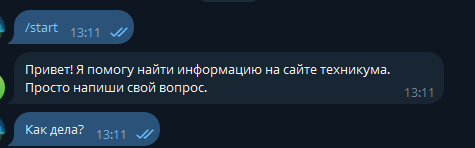
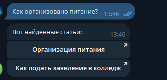

# Telegram-бот для образовательного учреждения

Telegram-бот, созданный с использованием Python и библиотеки Aiogram. Бот отвечает на часто задаваемые вопросы, а также предоставляет актуальную информацию об учебном процессе.

## Функциональность

- Ответы на частые вопросы
- Регистрация на курсы и мероприятия
- Информация о расписании и учебных планах
- Поиск по базе знаний (BM25)

## 🛠 Используемые технологии

- Python 3.10+
- [Aiogram](https://docs.aiogram.dev)
- BM25 (через `rank_bm25`)

## Скриншоты



## В планах

-Написать API для бота
-Сделать админ-панель для пополнения статей

## Установка и запуск

```bash
git clone https://github.com/username/bot-project.git
cd bot-project
python -m venv venv
source venv/bin/activate  # Для Windows: venv\Scripts\activate
pip install -r requirements.txt
python main.py
